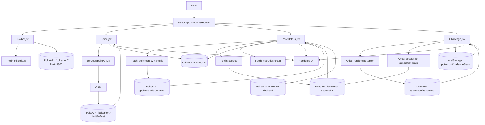

<p align="center">
	
</p>

<h1 align="center">PokeWorld</h1>

<p align="center">A modern React + Vite Pokedex with an interactive "Who's That Pokemon?" challenge mode.</p>

PokeWorld is a React + Vite web app for exploring Pokemon data with a modern Pokedex experience and a built-in "Who's That Pokemon?" challenge game.

The app uses PokeAPI as its primary data source and provides:

- Paginated Pokemon browsing
- Fast search with trie-based autocomplete suggestions
- Rich Pokemon detail pages (stats, abilities, moves, sprites, evolution chain)
- Interactive challenge mode with scoring, hints, and persistent player stats

## Table of Contents

1. Overview
2. Features
3. Tech Stack
4. Project Structure
5. Routes
6. Getting Started
7. Available Scripts
8. Data Sources
9. Architecture Notes
10. API and Data-Flow Diagram
11. Docker Notes
12. Future Improvements

## Overview

PokeWorld is organized into three primary user flows:

1. Home page: browse and paginate through Pokemon cards.
2. Details page: inspect deep information for any Pokemon.
3. Challenge page: play a silhouette-guessing game with multiple difficulties.

Navigation is handled with React Router, while data fetching is performed through both Axios and the native Fetch API depending on the feature.

## Features

### 1. Pokedex browsing

- Pulls Pokemon list from PokeAPI with limit/offset pagination.
- Shows official artwork cards with smooth entry animations.
- Includes previous/next controls and current page indicator.

### 2. Search and autocomplete

- Sticky navbar search available across pages.
- Loads Pokemon names into a trie for efficient prefix suggestions.
- Navigates directly to Pokemon details by name.

### 3. Pokemon details experience

- Dynamic theming based on primary Pokemon type.
- Tabs for:
	- Stats (circular and bar visualizations)
	- Abilities
	- Moves list
	- Sprite gallery
- Sprite mode toggles (artwork/front/back + shiny).
- Pokemon cry playback.
- Evolution chain visualization with navigation.
- Flavor text (Pokedex entry), capture rate, base happiness, growth rate, habitat, and more.

### 4. Challenge mode (Who's That Pokemon?)

- Random Pokemon silhouette guessing game.
- Difficulty presets:
	- Easy
	- Medium
	- Hard
- Hint system with usage limits per difficulty.
- Attempt-based gameplay and score calculation.
- Player metrics persisted in localStorage:
	- Score
	- Current streak
	- Best streak
	- Total games
	- Wins / win rate

## Tech Stack

- React 19
- React Router DOM 7
- Vite 7
- Tailwind CSS 3
- Axios
- Lucide React (icons)
- ESLint 9 (flat config)

## Project Structure

```text
pokiworld/
	public/
	src/
		assets/
		components/
			Navbar.jsx          # Global nav + trie-backed search
			pokeCard.jsx        # Animated Pokemon card UI
		pages/
			Home.jsx            # Paginated Pokemon explorer
			PokeDetails.jsx     # Deep Pokemon detail view
			Challenge.jsx       # Guess-the-Pokemon game
		services/
			pokeAPI.js          # Axios helper for list fetch
		styles/
			home.css            # Legacy/commented styles
		utils/
			trie.js             # Trie implementation for suggestions
		App.jsx               # Route map
		index.css             # Tailwind entrypoint
		main.jsx              # React mount point
	Dockerfile
	eslint.config.js
	postcss.config.js
	tailwind.config.js
	vite.config.js
```

## Routes

- / : Home page with Pokemon browsing and challenge call-to-action.
- /pokemon/:name : Pokemon detail page.
- /challenge : "Who's That Pokemon?" challenge mode.

## Getting Started

### Prerequisites

- Node.js 20+ recommended
- npm

### Installation

```bash
npm install
```

### Run in development

```bash
npm run dev
```

Then open the local URL shown in the terminal (typically http://localhost:5173).

## Available Scripts

- npm run dev: start Vite dev server.
- npm run build: create production build in dist/.
- npm run preview: preview production build locally.
- npm run lint: run ESLint checks.

## Data Sources

- PokeAPI REST API: https://pokeapi.co/
- Official artwork assets via PokeAPI sprite repository:
	- https://raw.githubusercontent.com/PokeAPI/sprites/master/sprites/pokemon/other/official-artwork/

## Architecture Notes

- Client-side routing with BrowserRouter.
- Home page list data is fetched via services/pokeAPI.js (Axios).
- Detail and challenge pages fetch Pokemon and species data directly.
- Search suggestions are generated in-memory using a trie built from the full Pokemon list.
- Challenge performance data is persisted in localStorage under pokemonChallengeStats.

## API and Data-Flow Diagram



This diagram reflects the current implementation: Home uses the Axios service helper, Details and Navbar use direct fetch calls, and Challenge combines API requests with localStorage persistence.

## Docker Notes

The repository Dockerfile supports both local development and production deployment via multi-stage targets.

### Production container (Nginx)

Build and run the `production` target:

```bash
docker build -t pokiworld .
docker run -p 80:80 pokiworld
```

Then open: http://localhost:8080

Notes:

- Vite build output is copied from `/app/dist`.
- Nginx is configured with `try_files` fallback so React Router routes such as `/pokemon/pikachu` work on page refresh.

## Future Improvements

- Add automated tests (unit + integration) for game logic and API handling.
- Add loading/error boundaries for all async sections.
- Add favorites persistence for the details page favorite toggle.
- Add accessibility pass (keyboard navigation and ARIA refinements).

## Credits

- Pokemon data provided by PokeAPI.
- Built with React, Vite, Tailwind CSS, and Lucide icons.
